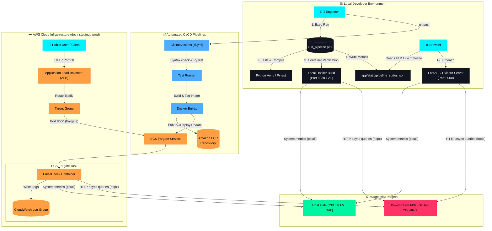

# PulseCheck 🩺
PulseCheck is a lightweight, automated system and API health-monitoring microservice. Built with **FastAPI** and a premium, modern dashboard utilizing **glassmorphism**, neon styling, and micro-animations, it serves as a central diagnostic board for engineers to audit environment health, host performance, downstream dependencies, and **live CI/CD build pipelines**.
---
## ⚡ Key Features
- **System Diagnostics**: Real-time reports of host CPU utilization, RAM usage, and Disk space.
- **Dynamic Dependency Probes**: Concurrently audits critical and non-critical external APIs (e.g., GitHub API, Cloudflare DNS).
- **CI/CD Visual Timeline**: Beautiful vertical pipeline visualization card integrated directly in the dashboard, updating live with step durations and detailed logs as builds run.
- **Robust Local & Cloud Automation**: Multi-pipeline configurations tailored for Local PowerShell sandbox test runs, GitHub Actions (automated push-to-ECR and ECS deployment), and Jenkins.
- **Enterprise Infrastructure**: Out-of-the-box infrastructure templates for AWS serverless container deployments using ECS Fargate, ALB, and CloudWatch.
---
## 🏗️ Project Architecture

---
## 📂 Project Structure
```text
pulsecheck/
├── app/
│   ├── main.py            # FastAPI main server & endpoint orchestration
│   ├── templates/
│   │   └── index.html     # Glassmorphic user interface with CI/CD visualizer
│   ├── static/
│   │   ├── css/
│   │   │   └── style.css  # Neon styling, animations & custom layout
│   │   └── js/
│   │       └── dashboard.js # Real-time polling, state transitions & canvas metrics
│   └── tests/
│       └── test_main.py   # Unit testing suite
├── infra/
│   ├── cloudformation.yaml # AWS ECS Fargate Infrastructure-as-Code (IaC)
│   └── docker-compose.yml  # Local multi-container orchestration
├── .github/workflows/
│   └── ci.yml             # GitHub Actions CI/CD (build-push-deploy to AWS)
├── Dockerfile             # Alpine/Slim production-grade container configuration
├── requirements.txt       # Python dependencies list
├── run_pipeline.ps1       # Local PowerShell automation pipeline with json-state updates
├── Jenkinsfile            # Jenkins Declarative pipeline automation (ECR/ECS ready)
└── README.md              # Documentation
```
---
## 🚀 Getting Started
### 1. Local Python Setup
To run the application locally outside of a container:
```bash
# Clone the repository and navigate inside
cd pulsecheck
# Create a virtual environment
python -m venv .venv
source .venv/bin/activate  # On Windows: .venv\Scripts\activate
# Install requirements
pip install -r requirements.txt
# Launch FastAPI using Uvicorn
uvicorn app.main:app --reload
```
Once running, navigate to [http://localhost:8000](http://localhost:8000) to view the interactive dashboard. You can access the raw JSON diagnostics report at `/health`.
---
### 2. Running via Docker
To run the containerized application locally:
```bash
# Build the container image
docker build -t pulsecheck:latest .
# Spin up the container mapping port 8080 (avoids conflicts with dev server on port 8000)
docker run -d -p 8080:8000 --name pulsecheck-app pulsecheck:latest
```
Alternatively, you can run the service from the `infra` directory using Docker Compose:
```bash
cd infra
docker compose up -d
```
Access the containerized app dashboard at [http://localhost:8080](http://localhost:8080).
---
## 🔄 Automated CI/CD Pipelines
### 1. Local Pipeline (PowerShell)
For developer sandbox environments, run the automated integration loop directly on your machine:
```powershell
powershell -ExecutionPolicy Bypass -File .\run_pipeline.ps1
```
*Note: Using `-ExecutionPolicy Bypass` prevents script execution blocks on restricted Windows environments.*
This script:
- Establishes a Python virtual environment and installs dependencies.
- Runs Python module syntax compilation validation.
- Runs unit tests via `pytest` (setting the correct `PYTHONPATH` context).
- Compiles the Docker container image locally.
- Spins up a test container on **port 8088** (preventing conflicts with the dev server on port 8000), pings it via E2E health probes, parses output, and cleans up resources.
- Publishes execution stage metrics dynamically to `app/static/pipeline_status.json` which renders live on the dashboard UI.
### 2. GitHub Actions (`.github/workflows/ci.yml`)
- Runs code compilation checks and `pytest` testing suites automatically on Pull Requests and commits to `main`.
- Integrates a complete deployment stage on branch pushes to configure AWS credentials, log in to **Amazon ECR**, build and tag the Docker container, push to ECR, and trigger a serverless **AWS ECS Fargate** service redeployment.
### 3. Jenkins Pipeline (`Jenkinsfile`)
A declarative build configuration file for Jenkins clusters:
- Checks out code, sets dependencies, compiles, and executes tests.
- Performs a simulated docker deployment on **port 8085** to run diagnostics verification.
- **Docker-in-Docker Network Routing Fix**: Inspects the test container's Docker bridge IP dynamically via `docker inspect` to perform `curl` health pings from within the Jenkins container network rather than relying on `localhost`.
- Configured with a `post { always { ... } }` cleanup hook to guarantee test containers are destroyed and removed even on build failures.
- Automates ECR push and Fargate redeployment.
---
## ☁️ Cloud Infrastructure (AWS CloudFormation)
The project includes an enterprise-ready CloudFormation template (`infra/cloudformation.yaml`) to provision a serverless, highly-available, secure network and compute resource on AWS.
The stack creates:
- **VPC** (10.0.0.0/16) with Internet Gateway.
- **Two Public Subnets** mapped across distinct Availability Zones for High Availability.
- **Application Load Balancer (ALB)** accepting HTTP request entries on port 80.
- **ECS Fargate Cluster & Service** running tasks with CPU/Memory limits.
- **CloudWatch Log Groups** capturing standard logging streams.
- **IAM Execution Role** allowing Fargate execution permissions.
### Deploying to AWS
Ensure your AWS CLI credentials are configured, then execute:
```bash
aws cloudformation create-stack \
  --stack-name pulsecheck-dev-stack \
  --template-body file://infra/cloudformation.yaml \
  --capabilities CAPABILITY_IAM \
  --parameters ParameterKey=EnvironmentName,ParameterValue=dev ParameterKey=ContainerImage,ParameterValue=YOUR_ECR_REGISTRY_URL/pulsecheck:latest
```
Once deployed, the Load Balancer DNS endpoint is exported under `ServiceUrl` outputs.
---
# Supporting ScreenShots
## 1. Local Pipeline Execution Succesfully passing.

## 2. Application Running Locally.


## 3. Output upon performing diagnosis - JSON output.

## 4. Developer's Dashboard.


https://github.com/user-attachments/assets/a0ccd280-fba3-41ec-83b8-a97c4b9d8d1e" />

