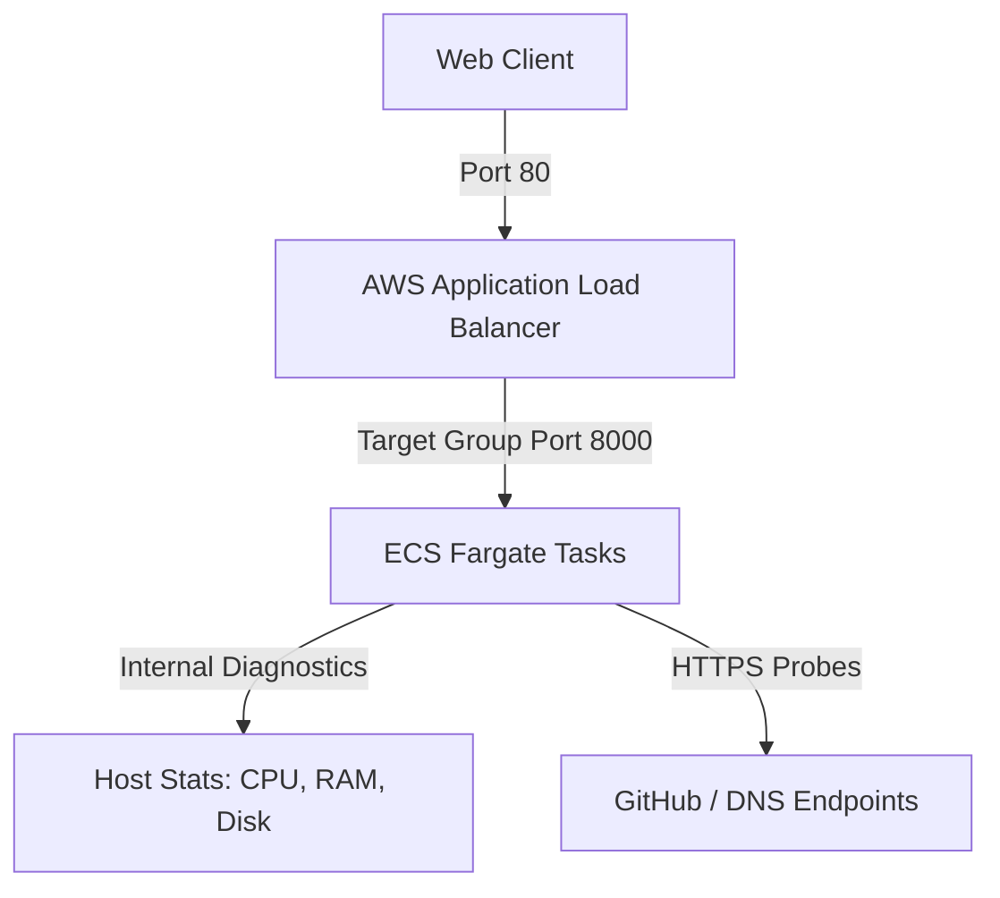

# PulseCheck 🩺

PulseCheck is a lightweight, automated system and API health-monitoring microservice. Built with **FastAPI** and a premium, modern dashboard utilizing **glassmorphism**, neon styling, and micro-animations, it serves as a central diagnostic board for engineers to audit environment health, host performance, and downstream dependencies.


---

## ⚡ Key Features

- **System Diagnostics**: Real-time reports of host CPU utilization, RAM usage, and Disk space.
- **Dynamic Dependency Probes**: Concurrently audits critical and non-critical external APIs (e.g. GitHub API, Cloudflare DNS).
- **Responsive Cyberpunk Dashboard**: Modern dark-theme UI with live gauge animations, manual refresh triggers, auto-polling configs, and a built-in copyable JSON viewer.
- **Multi-Pipeline CI/CD**: Integration suites configured for GitHub Actions, Jenkins, and local PowerShell testing environments.
- **Enterprise Infrastructure**: Out-of-the-box infrastructure templates for AWS serverless container deployments using ECS Fargate, ALB, and CloudWatch.

---

## 🏗️ Project Architecture



---

## 📂 Project Structure

```text
pulsecheck/
├── app/
│   ├── main.py            # FastAPI main server & endpoint orchestration
│   ├── templates/
│   │   └── index.html     # Glassmorphic user interface
│   ├── static/
│   │   ├── css/
│   │   │   └── style.css  # Neon styling, animations & custom layout
│   │   └── js/
│   │       └── dashboard.js # Real-time polling, state transitions & canvas metrics
│   └── tests/
│       └── test_main.py   # Unit testing suite
├── infra/
│   ├── cloudformation.yaml # AWS ECS Fargate Infrastructure-as-Code (IaC)
│   └── docker-compose.yml  # Local multi-container orchestration
├── .github/workflows/
│   └── ci.yml             # GitHub Actions CI workflow
├── Dockerfile             # Alpine/Slim production-grade container configuration
├── requirements.txt       # Python dependencies list
├── run_pipeline.ps1       # Local PowerShell automation pipeline
├── Jenkinsfile            # Jenkins Declarative pipeline automation
└── README.md              # Documentation
```

---

## 🚀 Getting Started

### 1. Local Python Setup

To run the application locally outside of a container:

```bash
# Clone the repository and navigate inside
cd pulsecheck

# Create a virtual environment
python -m venv .venv
source .venv/bin/activate  # On Windows: .venv\Scripts\activate

# Install requirements
pip install -r requirements.txt

# Launch FastAPI using Uvicorn
uvicorn app.main:app --reload
```

Once running, navigate to [http://localhost:8000](http://localhost:8000) to view the interactive dashboard. You can access the raw JSON diagnostics report at `/health`.

---

### 2. Running via Docker

To run the containerized application locally:

```bash
# Build the container image
docker build -t pulsecheck:local .

# Spin up the container mapping port 8000
docker run -d -p 8000:8000 --name pulsecheck_app pulsecheck:local
```

Alternatively, you can run the service from the `infra` directory using Docker Compose:

```bash
cd infra
docker compose up -d
```

---

## 🔄 Automated CI/CD Pipelines

PulseCheck includes configuration and automation configurations for three separate pipeline systems:

### 1. Local Pipeline (PowerShell)
For developer sandbox environments without cloud access, run the automated integration loop directly on your machine:
```powershell
powershell -ExecutionPolicy Bypass -File .\run_pipeline.ps1
```


This script will:
- Establish a Python virtual environment.
- Install dependencies.
- Compile Python modules to detect syntax issues.
- Execute the `pytest` unit test suite.
- Compile the Docker container image.
- Start a local container, perform an end-to-end API probe check, print results, and tear down the container.

### 2. GitHub Actions (`.github/workflows/ci.yml`)
Runs syntax linting, `pytest` unit checks, and verifies the Docker container compilation on every code push or Pull Request to the main branch.

### 3. Jenkins Pipeline (`Jenkinsfile`)
A declarative build configuration file for organizations managing local Jenkins build clusters. It provides automated test coverage, builds images, and conducts endpoint checks on a temporary local deployment.

---

## ☁️ Cloud Infrastructure (AWS CloudFormation)

The project includes an enterprise-ready CloudFormation template (`infra/cloudformation.yaml`) to provision a serverless, highly-available, secure network and compute resource on AWS.

The stack creates:
- **VPC** (10.0.0.0/16) with Internet Gateway.
- **Two Public Subnets** mapped across distinct Availability Zones for High Availability.
- **Application Load Balancer (ALB)** accepting HTTP request entries on port 80.
- **ECS Fargate Cluster & Service** running tasks with CPU/Memory limits.
- **CloudWatch Log Groups** capturing standard logging streams.
- **IAM Execution Role** allowing Fargate execution permissions.

### Deploying to AWS

Ensure your AWS CLI credentials are configured, then execute:

```bash
aws cloudformation create-stack \
  --stack-name pulsecheck-dev-stack \
  --template-body file://infra/cloudformation.yaml \
  --capabilities CAPABILITY_IAM \
  --parameters ParameterKey=EnvironmentName,ParameterValue=dev ParameterKey=ContainerImage,ParameterValue=YOUR_ECR_REGISTRY_URL/pulsecheck:latest
```
Once deployed, the Load Balancer DNS endpoint is exported under `ServiceUrl` outputs.
